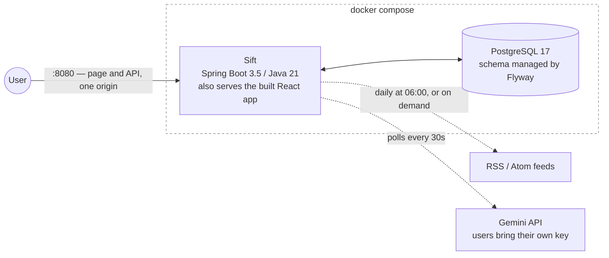
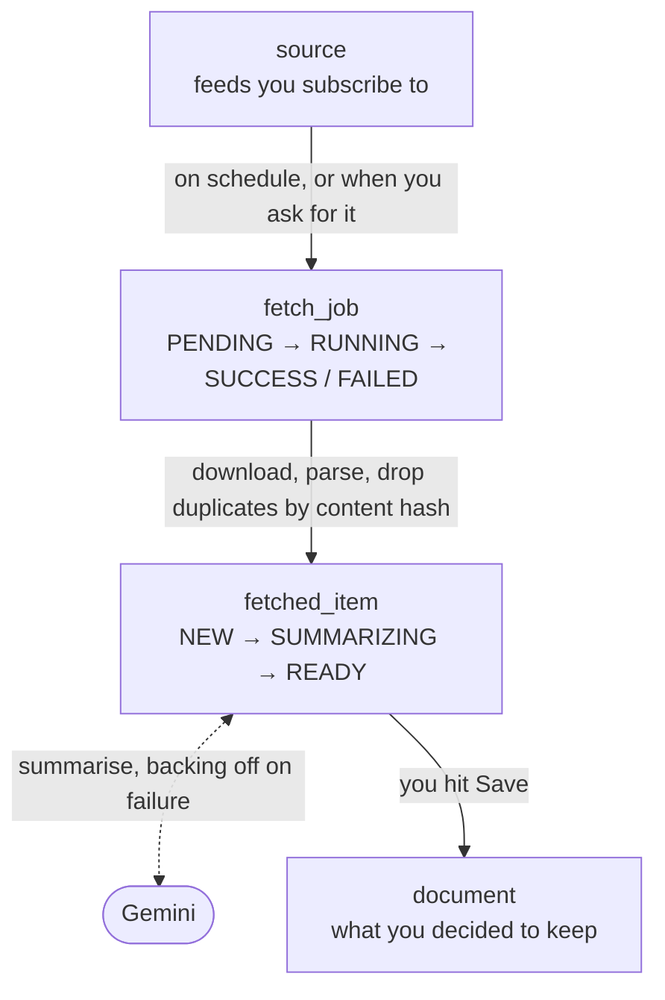

# Sift

[](https://github.com/domitoast/sift/actions/workflows/ci.yml)

我每天要看的技術部落格太多，看不完。

所以寫了這個：訂閱幾個 RSS，系統每天自己去抓，去掉重複的，用 AI 寫個摘要，我掃過之後只把想留的收進收藏庫。

---

## 長什麼樣子



虛線那兩條是對外的網路呼叫，也是整個系統最容易出事的地方。所以它們都有逾時上限、失敗分類跟重試策略，而且都不包在資料庫交易裡——交易裡做網路 I/O 會把連線池吃光。

## 資料怎麼流

一篇文章從 RSS 到收藏庫要經過四張表：



這四段不會互相呼叫，只透過資料庫的狀態欄位溝通。好處是任一段掛掉其他段照常跑，重啟之後從資料庫接著做。代價是得多一支排程，去收拾那些「開始了但永遠不會結束」的任務。

---

## 現在能做什麼

**收藏庫**

| 功能 | 說明 |
|---|---|
| 註冊 / 登入 | 密碼用 BCrypt。access token 放在回應裡、只留在頁面記憶體；refresh token 放在 HttpOnly cookie，頁面上的 JavaScript 讀不到 |
| Token 換發 | access token 15 分鐘過期，自動用 refresh token 換新的 |
| 登出 | 讓 refresh token 立即失效 |
| 筆記 CRUD | 也可以自己手寫，刪除是 soft delete |
| 列表與搜尋 | 分頁，預設每頁 20 筆 |

**抓取管線**

| 功能 | 說明 |
|---|---|
| 訂閱管理 | 新增當下就試抓一次，網址不能用就進不了資料庫 |
| RSS autodiscovery | 填網站首頁也行，會自己找出真正的 feed 網址 |
| 定時抓取 | 每天 06:00 一次，每次抓取的狀態與失敗原因都留著 |
| 非同步抓取 | 手動抓取回 202 + `jobId`，背景執行緒池處理，前端輪詢進度 |
| 自動抓第一輪 | 訂閱完就排一次抓取，不用再手動按 |
| 卡住自動回收 | 逾時沒結束的任務會被標成失敗，否則重啟一次那個來源就永遠抓不動 |
| 去重 | 看內容雜湊，網址帶不同追蹤參數不會被當成新文章 |
| AI 摘要 | 使用者自帶 API key，加密後存放 |
| 失敗重試 | 暫時性失敗 exponential backoff，最多 3 次 |
| 每日配額 | 防止哪天排程設錯就狂打 API |
| 收藏 / 丟棄 | 摘要好之後由你決定，系統不自動收 |

**前端**（React + Vite）

| 功能 | 說明 |
|---|---|
| 訂閱管理 | 新增、切換、看每個來源有幾篇待讀 |
| 文章列表 | 已經處理過的預設收起來，一鍵展開 |
| 閱讀器 | 分割／全螢幕，字級行距字體紙色版面寬度都能調 |
| 深色 / 亮色 | CSS 變數切換，記在 localStorage |
| Token 自動續期 | 過期時自動換一張再重送，使用者不會察覺 |

## 還沒做

- 翻譯（英文文章翻成中文）
- 訂閱項目的排序與分頁還在前端算，資料一多就不準
- 實際部署到公開網址（目前 CD 的終點是 registry）

---

## 跑起來

需要 Java 21 和 Docker，不用另外裝 Maven（專案內含 wrapper）。

```bash
git clone https://github.com/domitoast/sift.git
cd sift
cp .env.example .env
```

`.env` 裡有兩把金鑰要自己產生：

```bash
openssl rand -base64 64    # 填進 SIFT_JWT_SECRET
openssl rand -base64 32    # 填進 SIFT_ENCRYPTION_SECRET
```

兩把是刻意分開的。簽章金鑰外洩代表 token 可以被偽造，加密金鑰外洩代表所有人的 API key 變明文——影響範圍不同，而且輪替其中一把時不該連帶弄壞另一把。

---

接下來有兩種跑法。**兩個都用 8080，所以一次只能跑一種。**

| | 什麼時候用 | 開哪個網址 |
|---|---|---|
| **A. 容器模式** | 給別人跑、驗證打包有沒有問題 | http://localhost:8080 |
| **B. 開發模式** | 寫程式。前端熱更新、後端能下中斷點 | http://localhost:5173 |

### A. 容器模式

```bash
docker compose up -d
```

一行把資料庫跟應用程式都叫起來。前端已經 build 好塞進同一個 image，由 Spring Boot 當靜態檔提供，所以只有 8080 一個 port。

打開 http://localhost:8080 就是完整的網站。

```bash
docker compose logs -f app     # 看日誌
docker compose ps              # 看兩個容器的狀態
docker compose stop app        # 只停應用程式，資料庫留著
docker compose down            # 全停，資料保留
docker compose down -v         # 全停並清空資料庫
docker compose up -d --build   # 改過程式碼之後要加 --build
```

也可以直接用 CI 建好的 image，不用自己 build：

```bash
docker pull ghcr.io/domitoast/sift:latest
```

這個模式會帶 `SPRING_PROFILES_ACTIVE=prod`：關掉 SQL log、隱藏健康檢查細節、不把 stack trace 回給呼叫端。開發模式不受影響。

### B. 開發模式

```powershell
.\scripts\dev.ps1
```

腳本會載入 `.env`、只起 postgres 容器並等它 healthy、需要的話跑 `npm install`、開兩個視窗跑前後端，最後等 `/actuator/health` 回 200 才跟你說可以用了。

| | |
|---|---|
| 前端 | http://localhost:5173 ← **開這個** |
| 後端 API | http://localhost:8080 |

兩個 port 是不同來源，瀏覽器本來會擋。`vite.config.js` 的 proxy 把 `/api` 轉給 8080，所以瀏覽器從頭到尾以為自己只在跟 5173 說話。

回到腳本那個視窗按 Enter 就會停掉前後端，資料庫留著。

> 如果剛才跑過容器模式，記得先 `docker compose stop app`，不然那個容器佔著 8080，後端會起不來。

<details>
<summary>手動啟動（非 Windows，或想知道腳本實際做了什麼）</summary>

```bash
# 1. 只起資料庫，等它 healthy
docker compose up -d postgres

# 2. 後端（Flyway 會自動建表）
#    .env 的變數要先進到環境裡，Spring Boot 不會自己讀 .env
export $(grep -v '^#' .env | xargs)
./mvnw spring-boot:run

# 3. 前端（另一個終端機）
cd web && npm install && npm run dev
```
</details>

### 測試

```bash
./mvnw test
```

要有 Docker 在跑，但不用先 `docker compose up`。測試用的 PostgreSQL 由 Testcontainers 自己開，測完自動刪掉，不會碰到開發用的那個。第一次跑會下載 `postgres:17-alpine`。

### 其他

```bash
curl -i http://localhost:8080/actuator/health   # 確認活著
.\scripts\reset-data.ps1                        # 清空文章，保留帳號與訂閱
```

---

## API

所有路徑都在 `/api/v1` 底下。`/auth/**` 和 `/actuator/health` 不用登入，其他都要。

| Method | 路徑 | 說明 |
|---|---|---|
| POST | `/auth/register` | 註冊 |
| POST | `/auth/login` | 登入，回傳兩張 token |
| POST | `/auth/refresh` | 換一張新的 access token |
| POST | `/auth/logout` | 作廢 refresh token |
| GET | `/me` | 自己的帳號資料，API key 只回遮罩 |
| PUT | `/me/llm-key` | 設定自己的 AI API key |
| DELETE | `/me/llm-key` | 移除 API key |
| POST | `/documents` | 建立筆記 |
| GET | `/documents` | 列表，可分頁可搜尋 |
| GET | `/documents/{id}` | 讀單篇 |
| PUT | `/documents/{id}` | 編輯，要帶 `version` |
| DELETE | `/documents/{id}` | 刪除 |
| GET | `/documents/{id}/versions` | 版本歷史 |
| POST | `/sources` | 新增訂閱，會當場試抓驗證 |
| GET | `/sources` | 列出自己的訂閱 |
| PATCH | `/sources/{id}` | 改名稱或啟用狀態 |
| DELETE | `/sources/{id}` | 取消訂閱，已抓的文章保留 |
| POST | `/sources/{id}/fetch` | 排一次抓取，回 **202 + `jobId`** |
| GET | `/fetch-jobs/{id}` | 那筆任務好了沒，前端每 2 秒問一次 |
| GET | `/sources/{id}/fetch-jobs` | 這個來源最近幾次抓得怎麼樣 |
| GET | `/sources/{id}/items` | 這個來源抓到的文章 |
| GET | `/fetched-items/{id}` | 單篇完整內容 |
| POST | `/fetched-items/{id}/promote` | 收藏，回 201 與新建的 document |
| POST | `/fetched-items/{id}/discard` | 丟棄，不刪資料 |

錯誤用 RFC 7807 Problem Details：

```json
{
  "type": "https://sift.dev/errors/document-conflict",
  "title": "編輯衝突",
  "status": 409,
  "detail": "這篇文件已被修改，請重新載入後再編輯",
  "instance": "/api/v1/documents/63",
  "currentVersion": 1
}
```

---

## 技術選型

| | 用什麼 | 為什麼 |
|---|---|---|
| 語言 | Java 21 | |
| 框架 | Spring Boot 3.5 | |
| 資料庫 | PostgreSQL 17 | 需要 partial index 配合 soft delete，MySQL 沒有（[ADR-007](docs/adr/ADR-007-choose-postgresql.md)） |
| 結構版控 | Flyway | 資料庫的變更也要進 Git、也要能重現 |
| 認證 | JWT + 資料庫存的 refresh token | 純 JWT 沒辦法登出（[ADR-010](docs/adr/ADR-010-refresh-token-persistence.md)） |
| AI | Gemini，介面隔離 | `Summarizer` 是介面，換供應商只是多一個實作；測試一律用假的 |
| 前端 | React + Vite | 跟後端同一個 port 部署，開發時用 Vite proxy 避開 CORS |

---

## 幾個想過比較久的地方

每個設計決定都寫在 [`docs/adr/`](docs/adr/)，包含當時考慮過但否決的選項。挑幾個比較有意思的：

**權限檢查寫在查詢條件裡，不是查完再比對**
（[ADR-013](docs/adr/ADR-013-ownership-check-in-query.md)）

Repository 只提供 `findByIdAndUserIdAndDeletedAtIsNull`，沒有「只用 id 查」的方法。這樣就不可能忘記加權限檢查，忘了的話根本編譯不過。

查不到別人的資料時回 404 而不是 403，因為 403 等於在告訴對方「這個 id 真的存在」。

**編輯衝突用 optimistic lock，而且做了兩層**
（[ADR-014](docs/adr/ADR-014-optimistic-lock-for-edit-conflict.md)）

我實際測過：兩個人先後儲存同一份筆記，後存的會把先存的蓋掉，而且伺服器回 200，沒有人會發現。

解法是讀取時回 `version`，編輯時帶回來比對。但光靠 JPA 的 `@Version` 不夠，因為 HTTP 每個請求都重新載入，載到的一定是最新的，過期的版本號在呼叫端手上。所以 Service 層另外做一次明確比對。

沒用 pessimistic lock，是因為那個鎖要跨越「使用者在思考」的時間，而伺服器不知道他什麼時候會送出，甚至不知道他是不是關掉分頁走了。

**refresh token 每次換發都輪替，用來偵測盜用**
（[ADR-011](docs/adr/ADR-011-refresh-token-rotation-in-place.md)）

一張 refresh token 只能用一次。如果同一張被用了兩次，代表有兩個人持有過它，其中一個是攻擊者。這時把那個使用者的所有憑證全部作廢，兩邊都重新登入。

原本設計成每次換發新增一列，算了一下發現一萬個使用者一年會產生 2 GB。改成原地更新同一列、多存一個「上一代的雜湊值」，偵測能力一樣，空間差 100 倍。

**refresh token 放 HttpOnly cookie，access token 只留記憶體**
（[ADR-019](docs/adr/ADR-019-refresh-token-in-httponly-cookie.md)）

一開始前端把兩張 token 都存在 `sessionStorage`。後端拆兩張票，是為了讓短命的那張常出門、長命的那張躲好；但兩張放在同一個 JavaScript 讀得到的地方，一次 XSS 就一起被拿走，拆開的意義就沒了，而且關分頁就被登出。

改成 refresh token 由後端用 HttpOnly cookie 發、只送往 `/api/v1/auth`，頁面讀不到；access token 只存在記憶體，打開頁面時先靜默換一次票。附帶踩到一個坑：同時好幾個請求拿到 401 各自去換票，會把同一張 refresh token 送兩次，被自己的盜用偵測當成竊取。所以前端把並發的換票合併成一次。

**跨聚合只存 id，不建立 JPA 關聯**
（[ADR-012](docs/adr/ADR-012-no-jpa-associations-across-aggregates.md)）

`Document` 只存 `userId`，沒有 `@ManyToOne User`。因為沒有任何一支 API 需要從筆記去取作者資料，建了關聯只是多一個 N+1 的來源。

這個決定後來有付出代價：摘要排程要「撈出擁有者已設定 API key 的文章」，那得跨三張表，而沒有關聯就沒辦法用 JPQL join。最後用了一句原生 SQL，並在那個方法上寫清楚理由——ADR-012 管的是 Java 物件之間不要互相持有，不是資料庫不准 join。

**排程沒有加 distributed lock**
（[ADR-018](docs/adr/ADR-018-no-distributed-lock.md)）

多實例部署時排程會重複執行，標準解法是 ShedLock。但我先去看了自己的 schema，發現 `fetch_job` 上的 partial unique index 已經擋住真正會造成傷害的那一層——兩個實例同時建立任務，第二個會撞唯一約束然後跳過。

所以沒裝，並寫下重新評估的條件：部署超過一個實例，或**新增任何一個「重複執行會造成傷害」的排程**（寄信、扣款）。第二條最容易被忽略，因為現在安全是因為現有排程剛好都有保護，下一個可能沒有。

**摘要失敗用 exponential backoff，而且加了 jitter**
（[ADR-008](docs/adr/ADR-008-day5-schema-simplification.md)）

暫時性失敗（429、timeout）等 60 秒 → 120 秒 → 240 秒後重試，最多 3 次。永久性失敗（API key 無效）不重試。

光有 backoff 還不夠：一批文章如果在同一秒失敗，它們的下次重試也會在同一秒，尖峰只是往後移了一分鐘。所以等待時間加了 ±20% 的隨機。

抓取失敗則完全不重試，等隔天排程就好。兩者的失敗特性不一樣，重試策略沒有理由一樣。

---

## 專案結構

```
src/main/java/dev/sift/
├── auth/          認證：JWT 簽發驗證、refresh token
├── user/          使用者：註冊、個人資料、API key 加解密
├── document/      收藏庫：CRUD 與版本歷史
├── source/        訂閱來源
├── fetch/         抓取管線：HTTP client、feed 解析、去重、非同步
├── summarize/     摘要：AI 介面、重試策略、配額
├── common/        全域例外處理、分頁回應格式
└── config/        Spring 設定

web/src/
├── App.jsx        主畫面：訂閱、文章列表、使用者選單
├── Reader.jsx     閱讀器
├── Library.jsx    收藏庫
├── useFetchJob.js 抓取進度輪詢
└── index.css      設計系統（CSS 變數、深淺色主題）

.github/workflows/ci.yml            push 就跑測試，main 才發佈 image
src/main/resources/db/migration/    Flyway migration（9 份）
docs/adr/                           設計決策紀錄（18 份）
```

---

## 測試

221 個測試，unit 跟 integration 大概各半，後者是真的起 Spring 跟 PostgreSQL。每次 push 由 GitHub Actions 跑一遍。

整合測試的比例比教科書建議的高很多，那是刻意的。回頭看實際踩到的 bug——例外處理器吞掉 404、測試設定檔遮蔽主設定、Hibernate 的 flush 時機——沒有一個是 unit test 抓得到的。

比較值得看的幾個：

- 別人的合法帳號讀不到你的筆記，而且回 404 看不出它存不存在
- 編輯衝突時先寫入者的內容必須完好無損（光是回 409 不夠）
- 同一篇文章換一組追蹤參數再抓一次，不會產生第二筆
- 使用者的 API key 在資料庫裡查不到明文，回應裡也只有遮罩
- 訂閱網址指向內部位址（`169.254.169.254`）時，連線在發出前就被拒絕

CI 的最後一步會把剛建好的 image 真的跑起來，等 `/actuator/health` 變 UP 才算過。build 成功只證明編譯得過，不證明跑得起來——這一步抓到過一次金鑰長度寫錯的問題。

---

## 已知問題

- 摘要沒有「原文沒變就不重算」的快取。現在一篇只會摘要一次所以沒差，但如果之後加了定期重摘就需要
- XSS 在頁面開著的期間，仍然可以直接拿記憶體裡的 access token 打 API。HttpOnly cookie 保護的是「長期憑證被帶走」，不是「頁面被控制」；後者要靠 Content-Security-Policy 之類的防線，目前沒做
- 摘要沒有手動觸發，抓完最多要等 30 秒才會有
- cron 不補跑。06:00 時程式沒開著的話那一輪就是沒發生
- 登入沒有防暴力破解
- 沒有限制 HTTP request body 的大小
- 有些來源的 `<description>` 本來就不是內文（例如 Hacker News 只給一個留言連結），摘要品質會受限。真要全文得去抓原始網頁，那是另一個工程
- `fetched_item` 永遠不會被刪。「丟棄」只是改狀態，因為去重靠的唯一索引不分狀態，真的刪掉那篇文章明天會再被抓進來
