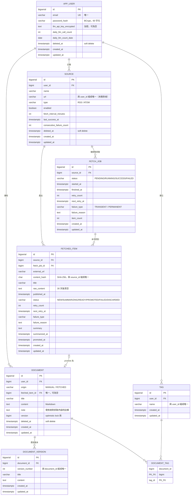

# ER Diagram

**繪製工具**：Mermaid（可直接在 GitHub、VS Code 中渲染）
**最後更新**：Day 3

---

## 完整關聯圖



---

## 關聯基數說明

Mermaid ER 圖的符號讀法：

| 符號 | 意義 |
|---|---|
| `\|\|` | 恰好一個（one and only one） |
| `o{` | 零或多個（zero or more） |
| `\|o` | 零或一個（zero or one） |

逐條說明：

| 關聯 | 基數 | 白話 |
|---|---|---|
| `APP_USER → SOURCE` | 1 對多 | 一個使用者可訂閱多個來源；每個來源只屬於一個使用者 |
| `SOURCE → FETCH_JOB` | 1 對多 | 一個來源會被排程抓取很多次，每次一筆紀錄 |
| `SOURCE → FETCHED_ITEM` | 1 對多 | 一個來源會產出很多篇文章 |
| `FETCH_JOB → FETCHED_ITEM` | 1 對多 | 一次抓取可能抓到 0 到 N 篇 |
| `FETCHED_ITEM → DOCUMENT` | **0或1 對 0或1** | 一筆 staging 項目最多 promote 成一份文件；<br>手寫文件則沒有對應的 staging 項目 |
| `DOCUMENT → DOCUMENT_VERSION` | 1 對多 | 一份文件有多個歷史版本 |
| `DOCUMENT ↔ TAG` | 多對多 | 透過 `DOCUMENT_TAG` 中介表 |

---

## 兩層架構在圖上的位置

```
┌──────────────── Pipeline（staging：可能失敗、可能重複）────────────────┐
│                                                                        │
│   SOURCE  ──→  FETCH_JOB  ──→  FETCHED_ITEM                            │
│                                     │                                  │
└─────────────────────────────────────┼──────────────────────────────────┘
                                      │ promote（僅 READY 狀態可晉升）
                                      ▼
┌──────────────── Knowledge Base（curated：一律是成品）─────────────────┐
│                                                                        │
│   DOCUMENT  ──→  DOCUMENT_VERSION                                      │
│      │                                                                 │
│      └──→  DOCUMENT_TAG  ←──  TAG                                      │
│                                                                        │
└────────────────────────────────────────────────────────────────────────┘
```

`FETCHED_ITEM → DOCUMENT` 這條線是整張圖唯一的跨層連結，
也是 ADR-002 決策的具體體現。

---

## 為什麼 FETCHED_ITEM 同時連到 SOURCE 和 FETCH_JOB

乍看之下 `source_id` 是多餘的——透過 `fetch_job_id` 就能查到 source。

保留它的理由是**查詢效率**。

「列出某個來源的所有文章」是最常見的查詢。
若只有 `fetch_job_id`，每次都必須 join `fetch_job` 才能過濾來源。
直接保留 `source_id` 可省下這個 join。

這是**刻意的反正規化（denormalization）**——
用一點冗餘換取查詢速度，是經過權衡後的選擇，而非疏漏。

代價是：若某筆 `fetched_item` 的 `source_id` 與其
`fetch_job.source_id` 不一致，資料就矛盾了。
因此寫入時必須由 Service 保證兩者一致。
