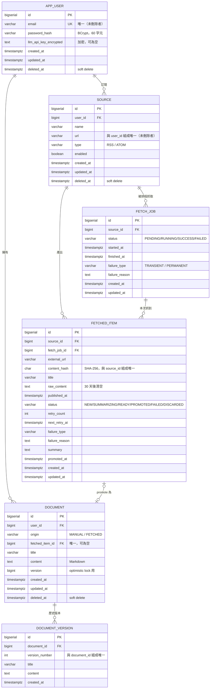

# ER Diagram

**繪製工具**：Mermaid（可直接在 GitHub、VS Code 中渲染）
**最後更新**：Day 5（ADR-008 精簡後）

---

## 完整關聯圖



---

## 關聯基數說明

Mermaid ER 圖的符號讀法：

| 符號 | 意義 |
|---|---|
| `\|\|` | 恰好一個（one and only one） |
| `o{` | 零或多個（zero or more） |
| `\|o` | 零或一個（zero or one） |

逐條說明：

| 關聯 | 基數 | 白話 |
|---|---|---|
| `APP_USER → SOURCE` | 1 對多 | 一個使用者可訂閱多個來源 |
| `APP_USER → DOCUMENT` | 1 對多 | 一個使用者有多份文件 |
| `SOURCE → FETCH_JOB` | 1 對多 | 一個來源會被抓取很多次，**每次一筆** |
| `SOURCE → FETCHED_ITEM` | 1 對多 | 一個來源會產出很多篇文章 |
| `FETCH_JOB → FETCHED_ITEM` | 1 對多 | **一次抓取通常抓到數十篇** |
| `FETCHED_ITEM → DOCUMENT` | 0或1 對 0或1 | 一筆 staging 最多晉升成一份文件；<br>手寫文件則無對應的 staging 項目 |
| `DOCUMENT → DOCUMENT_VERSION` | 1 對多 | 一份文件有多個歷史版本 |

---

## 一次抓取實際發生什麼（數量關係）

這是最容易誤解的地方：

```
早上 07:00，排程觸發，抓 Hacker News

fetch_job  第 1 筆          ← 「去抓 Hacker News 這個動作」
   │
   ├── fetched_item 第 1 筆   ← 抓到的第 1 篇文章
   ├── fetched_item 第 2 筆
   ├── ...
   └── fetched_item 第 30 筆  ← 第 30 篇
```

**一次動作、三十篇文章。**

因此資料量估算為：

| 表 | 每天 | 一年 | 備註 |
|---|---|---|---|
| `fetch_job` | 來源數（例：2） | 730 筆 | 極小 |
| `fetched_item` | 來源數 × 每源篇數（例：60） | 約 21,900 筆 | 有 30 天清除策略 |

---

## 兩層架構在圖上的位置

```
┌──────────── Pipeline（staging：可能失敗、可能重複）──────────────┐
│                                                                   │
│   SOURCE  ──→  FETCH_JOB  ──→  FETCHED_ITEM                       │
│                                     │                             │
└─────────────────────────────────────┼─────────────────────────────┘
                                      │ promote（僅 READY 可晉升）
                                      ▼
┌──────────── Knowledge Base（curated：一律是成品）────────────────┐
│                                                                   │
│   DOCUMENT  ──→  DOCUMENT_VERSION                                 │
│                                                                   │
└───────────────────────────────────────────────────────────────────┘
```

`FETCHED_ITEM → DOCUMENT` 是整張圖唯一的跨層連結，
也是 ADR-002 決策的具體體現。

---

## 為什麼 FETCHED_ITEM 同時連到 SOURCE 和 FETCH_JOB

透過 `fetch_job_id` 就能查到 source，`source_id` 看似多餘。

保留它的理由是**查詢效率**：「列出某來源的所有文章」是最常見的查詢，
若只有 `fetch_job_id`，每次都必須 join `fetch_job` 才能過濾。

這是**刻意的反正規化（denormalization）**——用一點冗餘換查詢速度。

代價是寫入時必須由 Service 保證兩個欄位一致。

---

## Day 5 移除的部分（ADR-008）

原圖曾包含 `TAG` 與 `DOCUMENT_TAG` 兩張表及其多對多關聯，
因 `PROJECT_RULES.md` 明訂不做標籤管理介面而移除——
沒有介面即無法建立標籤，該表永遠為空。

需要時以 V2 migration 加回。
